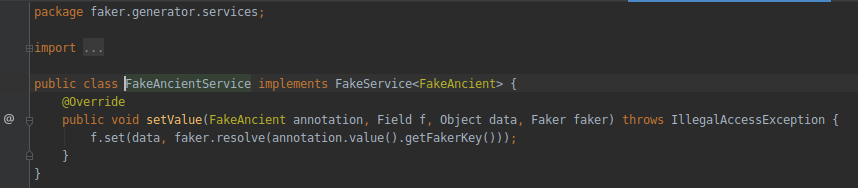

# Faker Generator

Is a library to wrap [Faker Project](https://github.com/DiUS/java-faker) if you include the library in your project
you can use the `FakeAnnotation` to create mock data.

## How help to include more methods.
1. First create a new implementation of annotation with the name that you want (package faker.generator)

1. Create a new class that implement `FakeService<T>` on the package `faker.generator.services` and write to code to 
implement the method

1. Write on the annotation create in the point 1 `@FakeServiceName` with the service name create on the step 2.
1. Write your test in a separated file.

